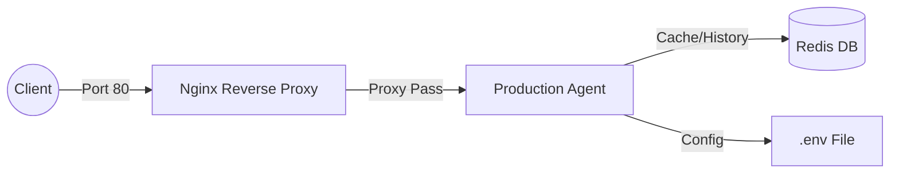

# Section 2 — Docker: Đóng Gói Agent Thành Container

## Mục tiêu học
- Hiểu container là gì và tại sao cần nó
- Viết Dockerfile đúng cách (single vs multi-stage)
- Dùng Docker Compose để chạy multi-service stack
- Tối ưu image size xuống dưới 500 MB

---

## Ví dụ Basic — Dockerfile Đơn Giản

```
develop/
├── app.py
├── Dockerfile          # Single-stage, dễ hiểu
├── .dockerignore
└── requirements.txt
```

### Chạy thử
```bash
# IMPORTANT: Build from project root!
cd ../..  # Go to project root

# Build image
docker build -f 02-docker/develop/Dockerfile -t agent-develop .

# Xem size
docker images agent-develop

# Chạy container
docker run -p 8000:8000 agent-develop

# Test
curl http://localhost:8000/health
```

---

## Ví dụ Advanced — Multi-Stage + Docker Compose

```
production/
├── app.py
├── Dockerfile              # Multi-stage build → image nhỏ hơn nhiều
├── docker-compose.yml      # Full stack: agent + vector store + redis
├── nginx/
│   └── nginx.conf          # Reverse proxy
├── .dockerignore
└── requirements.txt
```

### Chạy thử
```bash
# From project root
cd ../..  # if not already there

# Khởi động toàn bộ stack (1 lệnh!)
docker compose -f 02-docker/production/docker-compose.yml up

# Xem các service đang chạy
docker compose -f 02-docker/production/docker-compose.yml ps

# Test agent qua Nginx
curl http://localhost/health

# Dừng toàn bộ
docker compose -f 02-docker/production/docker-compose.yml down
```

### Sơ đồ kiến trúc (Exercise 2.4)


### So sánh image size:

```bash
# Basic vs Advanced (Kết quả thực tế trên máy của tôi)
docker images | findstr agent
# agent-basic      ~  1.66 GB  ← python:3.11 base (Rất nặng!)
# production-agent ~   236 MB  ← python:3.11-slim + multi-stage (Tối ưu 7x)
```

---

## Lý thuyết: Tại Sao Multi-Stage?

```dockerfile
# Stage 1: Builder — có đầy đủ tools để compile deps
FROM python:3.11 AS builder   # 1 GB
RUN pip install ...            # thêm deps vào layer này

# Stage 2: Runtime — chỉ copy những gì cần chạy
FROM python:3.11-slim          # 150 MB ← bắt đầu từ image sạch
COPY --from=builder ...        # copy chỉ /site-packages
```

**Kết quả:** Final image chỉ có runtime, không có pip, không có build tools → nhỏ và an toàn hơn.

---

## Câu hỏi thảo luận

1. **Tại sao `COPY requirements.txt .` rồi `RUN pip install` TRƯỚC khi `COPY . .`?**
   > **Trả lời:** Đây là kỹ thuật **Layer Caching**. Docker lưu lại kết quả của từng lệnh thành một layer. `pip install` thường tốn nhiều thời gian. Nếu chúng ta copy toàn bộ code trước, mỗi khi sủa 1 dòng code, Docker sẽ phải chạy lại `pip install`. Bằng cách copy `requirements.txt` riêng, Docker chỉ chạy lại lệnh này khi file requirements thay đổi, giúp build image cực nhanh (chỉ mất vài giây thay vì vài phút).

2. **`.dockerignore` nên chứa những gì? Tại sao `venv/` và `.env` quan trọng?**
   > **Trả lời:** `.dockerignore` nên chứa `__pycache__`, `.git`, `venv/`, `.env`, và các file log.
   > - **`venv/`**: Chúng ta không muốn copy bộ thư viện từ máy local (có thể khác hệ điều hành) vào container. Container sẽ tự cài thư viện riêng.
   > - **`.env`**: Tránh việc commit nhầm API key vào Docker Image. Image có thể được đẩy lên Docker Hub public, nếu có `.env` thì bí mật của bạn sẽ bị lộ.

3. **Nếu agent cần đọc file từ disk, làm sao mount volume vào container?**
   > **Trả lời:** Chúng ta sử dụng tham số `-v` (volume). Ví dụ: `docker run -v C:/data:/app/data agent-image`. Hoặc trong Docker Compose, định nghĩa phần `volumes: - ./data:/app/data`. Điều này giúp dữ liệu persists (tồn tại) ngay cả khi container bị xóa.
