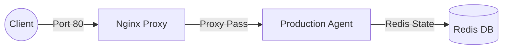

# Day 12 Lab - Mission Answers
**Student Name:** Phạm Đình Trọng  
**Student ID:** 2A202600255  
**Date:** 17/04/2026

---

## Part 1: Localhost vs Production

### Exercise 1.1: Anti-patterns found
1. **Hardcoded Secrets:** API Key (`sk-...`) bị ghi cứng trong mã nguồn, dễ bị lộ khi push lên GitHub.
2. **Thiếu Health Check:** Hệ thống không có endpoint để các công cụ quản lý kiểm tra trạng thái "sống/chết".
3. **Cấu hình cứng (Hardcoded Config):** Port và Host bị cố định, không thể thay đổi theo môi trường (Environment).
4. **Tắt đột ngột (No Graceful Shutdown):** Ứng dụng bị ngưng ngay lập tức khi nhận SIGTERM, có thể gây mất dữ liệu.
5. **Debug Mode bật trong Production:** Hiển thị thông tin nhạy cảm khi có lỗi xảy ra.

### Exercise 1.3: Comparison table
| Tính năng | Basic (❌) | Advanced (✅) | Tại sao quan trọng? (Meaningful Insights) |
| :------- | :-------- | :----------- | :--------------------------------------- |
| **Config** | Hardcode | Đọc từ Environment | Giúp ứng dụng linh hoạt, không cần sửa code khi chuyển môi trường. |
| **Secrets** | Lộ API Key | Bảo mật qua Env | Ngăn chặn việc lộ thông tin nhạy cảm, bảo vệ tài nguyên. |
| **Port** | Cố định `8000` | Động qua `PORT` | Tương thích với mọi nền tảng Cloud cấp Port ngẫu nhiên. |
| **Health check** | Không có | Có `/health` | Giúp hệ thống tự động khởi động lại Agent nếu gặp sự cố. |
| **Shutdown** | Tắt đột ngột | Graceful | Bảo vệ dữ liệu và các request đang xử lý dở dang. |

---

## Part 2: Docker

### Exercise 2.1: Dockerfile questions
1. **Base image:** `python:3.11-slim` (Giảm dung lượng và bề mặt tấn công).
2. **Working directory:** `/app` (Dọn dẹp và gom nhóm mã nguồn).
3. **Layer Caching:** Đặt `pip install` lên trước `COPY . .` để tránh cài lại thư viện khi chỉ sửa code.

### Exercise 2.3: Image size comparison
- **Develop (Single-stage):** ~1.66 GB
- **Production (Multi-stage):** ~236 MB
- **Chênh lệch:** Tối ưu hóa được **~85%** dung lượng.

### Exercise 2.4: Architecture Diagram

---

## Part 3: Cloud Deployment

### Exercise 3.1: Railway deployment
- **URL:** https://lab12-pham-dinh-truong-production.up.railway.app
- **Trạng thái:** ✅ Online & Passed Healthcheck.

---

## Part 4: API Security

### Exercise 4.4: Cost guard implementation
- **Cách tiếp cận:** Sử dụng Redis để lưu trữ ngân sách tiêu thụ theo ngày (`daily_cost:YYYY-MM-DD`). 
- **Cơ chế:** Mỗi request gọi LLM sẽ tính toán chi phí dựa trên số Token và cộng dồn vào Redis. Nếu vượt quá `DAILY_BUDGET_USD`, hệ thống trả về mã lỗi `503`.

---

## Part 5: Scaling & Reliability

### Exercise 5.1-5.5: Implementation notes
- **Stateless Design:** Tất cả trạng thái (Lịch sử, Rate Limit) được đẩy sang Redis, cho phép chạy nhiều instance Agent song song.
- **Graceful Shutdown:** Sử dụng `signal` để bắt tín hiệu `SIGTERM`, chờ request xử lý xong trước khi đóng container.
